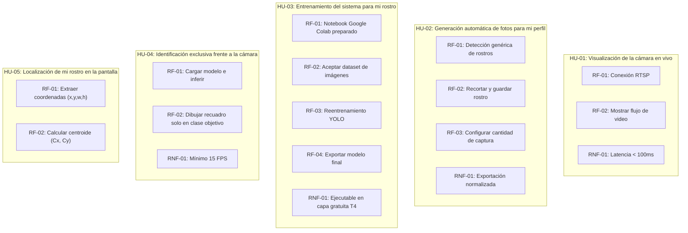

# Grafo de Dependencias -- seguidorCam

_Generado automaticamente el 2026-08-06T00:07:29.549Z -- no editar a mano, se sobreescribe en cada publicacion._

```mermaid
graph TD
  subgraph US_1785973986502["HU-01: Visualización de la cámara en vivo"]
    REQ_1785974832467["RF-01: Conexión RTSP"]
    REQ_1785974833072["RF-02: Mostrar flujo de video"]
    REQ_1785974833983["RNF-01: Latencia < 100ms"]
  end
  subgraph US_1785973986827["HU-02: Generación automática de fotos para mi perfil"]
    REQ_1785974834220["RF-01: Detección genérica de rostros"]
    REQ_1785974834478["RF-02: Recortar y guardar rostro"]
    REQ_1785974835053["RF-03: Configurar cantidad de captura"]
    REQ_1785974835757["RNF-01: Exportación normalizada"]
  end
  subgraph US_1785973987016["HU-03: Entrenamiento del sistema para mi rostro"]
    REQ_1785974835958["RF-01: Notebook Google Colab preparado"]
    REQ_1785974838027["RF-02: Aceptar dataset de imágenes"]
    REQ_1785974838161["RF-03: Reentrenamiento YOLO"]
    REQ_1785974838308["RF-04: Exportar modelo final"]
    REQ_1785974840878["RNF-01: Ejecutable en capa gratuita T4"]
  end
  subgraph US_1785973987206["HU-04: Identificación exclusiva frente a la cámara"]
    REQ_1785974842418["RF-01: Cargar modelo e inferir"]
    REQ_1785974843644["RF-02: Dibujar recuadro solo en clase objetivo"]
    REQ_1785974843884["RNF-01: Mínimo 15 FPS"]
  end
  subgraph US_1785973987388["HU-05: Localización de mi rostro en la pantalla"]
    REQ_1785974846222["RF-01: Extraer coordenadas (x,y,w,h)"]
    REQ_1785974849536["RF-02: Calcular centroide (Cx, Cy)"]
  end
```